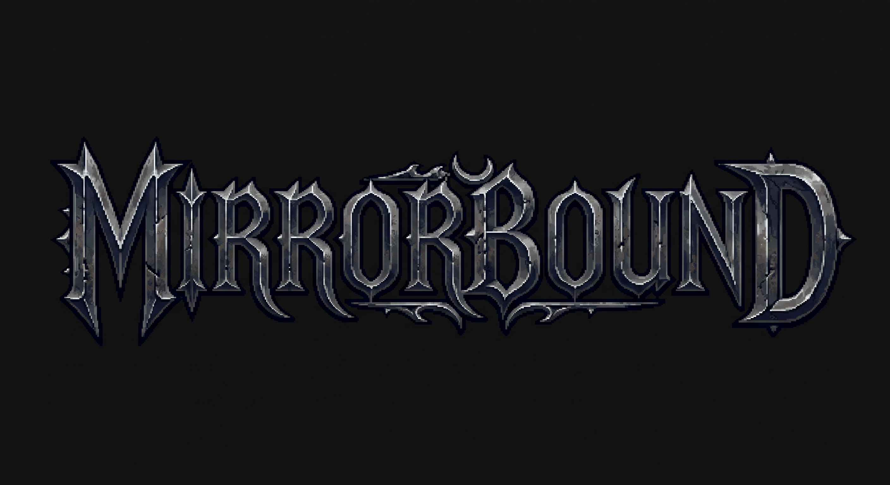

<p align="center">
  
</p>

# MirrorBound

**You play. Your twin watches. Your twin learns. Eventually, your mirror fights back.**

MirrorBound is a single-player action-RPG where your playstyle shapes your ultimate challenge. Built around a dynamic utility-AI companion that learns from your actions and outcomes, your "twin" adapts to how you fight, move, and survive. In the end, the final boss uses your accumulated habits against you.

---

## 🎮 Play the Game
- **Frontend (Vercel):** [Coming Soon - Add Vercel Link]
- **Backend (Render):** [Coming Soon - Add Render Link]

---

## 🚀 Key Features

- **Adaptive AI Twin:** A rescued twin that fights alongside you. It learns your behavior through continuous pattern detection, spatial heatmaps, and decaying sequence predictions.
- **Dynamic Combat:** 5 unique areas, 13 dungeon rooms, and a variety of enemies including ordinary mobs, elites, the Ashen Warden guardian, and the ultimate Mirror Boss.
- **Deep Progression:** 4 equipable weapons with unique abilities, 3 relics, 12 skill nodes, and a fully featured inventory and skill system.
- **Rich World:** Hollow Reach, Wakewood Crypt, Emberfall, Ashen Deep, and Mirror Sanctum await. Discover secrets, trade with NPCs, and rest at hearths.

---

## 🏗️ Architecture

MirrorBound is designed with a strict separation of concerns, ensuring determinism and scalable AI integration.

- **Frontend (TypeScript, React, Phaser 3):** Deployed on **Vercel**. The browser serves exclusively as a presentation layer. It renders snapshots and forwards user input, but holds no authoritative game logic.
- **Backend (Python 3.12+, FastAPI, WebSocket):** Deployed on **Render**. The Python server owns the ground truth for movement, combat, loot, and progression. The AI agent runs as an independent layer, subscribing to the simulation's event bus to analyze telemetry and issue commands without mutating the game state directly.

---

## 🛠️ Local Development Setup

To run MirrorBound locally, you'll need two terminal windows—one for the Python server and one for the frontend client.

### Prerequisites
- Python 3.12+ and [uv](https://docs.astral.sh/uv/)
- Node.js (22.22.2+, 24.15+, or 26+) and npm

### 1. Start the Server (Backend)
```bash
cd apps/server
uv sync
uv run uvicorn mirrorbound.api.app:create_app --factory --host 127.0.0.1 --port 8000 --reload
```

### 2. Start the Client (Frontend)
```bash
cd src/web
npm ci
npm run dev
```

Open [http://127.0.0.1:5173/](http://127.0.0.1:5173/) to play. 

---

## 🎮 Controls

| Key | Action |
|---|---|
| `W A S D` / arrows | Move |
| `Shift` | Run |
| Mouse position | Aim attacks and spells |
| `J` / `Space` | Basic attack |
| `1`–`4` | Abilities from carried weapons |
| `Q` | Swap weapons |
| `E` | Interact / Talk to NPC |
| `F` / `G` | Health / mana potion |
| `I` / `K` / `C` / `M` | Inventory / Skills / Character / Map |
| `P` / `Esc` | Pause |

---

## 📚 Technical Documentation

Dive deeper into MirrorBound's architecture and design:
- [FEATURE_STATUS.md](FEATURE_STATUS.md) — Release inventory and remaining work.
- [ARCHITECTURE.md](ARCHITECTURE.md) — Core system design.
- [AI_ARCHITECTURE.md](AI_ARCHITECTURE.md) — Modeling, utility decisions, and boss counters.
- [GAMEPLAY.md](GAMEPLAY.md) — Gameplay and mechanic design.
- [AGENTS.md](AGENTS.md) — Codebase contribution rules.

---

*Developed for Vinhack*
