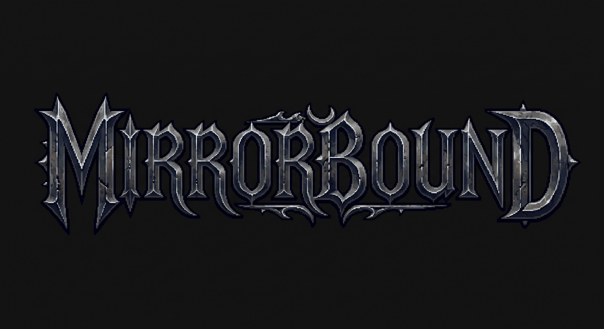

<p align="center">
  
</p>

# MirrorBound

**You play. Your twin watches. Your twin learns. Eventually, your mirror fights back.**

MirrorBound is a single-player action-RPG where your playstyle shapes your ultimate challenge. Built around a dynamic utility-AI companion that learns from your actions and outcomes, your "twin" adapts to how you fight, move, and survive. In the end, the final boss uses your accumulated habits against you.

---

## 🎮 Play the Game
- **Frontend (Vercel):** [Coming Soon - Add Vercel Link]
- **Backend (Render):** [Coming Soon - Add Render Link]

---

## 🚀 Key Features

- **Adaptive AI Twin:** A rescued twin that fights alongside you. It learns your behavior through continuous pattern detection, spatial heatmaps, and decaying sequence predictions.
- **One continuous world:** Six regions you cross on foot, joined at named crossings — the Rootbridge, the Long Causeway, Kell's ferry, the Cut through the rock. Villages stand *inside* regions, so you come over the ridge and walk in with nothing loading.
- **Three dungeon archetypes:** Combat, puzzle and mirror dungeons that differ in what opens the far door — clear the room, work out what opens it, or both at once. Branching side rooms, keys and plates.
- **Four bosses before the last one:** The Stonecount, the Kiln Shardmother and the Ashen Warden each run a three-phase, fully telegraphed ladder. Only the Mirror reads your behaviour model — that premise belongs to the ending.
- **Deep Progression:** 6 weapons with weapon-bound abilities, a three-tier upgrade bench that finally spends your shards and essence, 20 skill nodes across five branches where everything past tier 1 changes how the game plays.
- **Quests and a codex:** Four side quests that exist to explain the world, and a codex that fills in as you find it out.

---

## 🏗️ Architecture

MirrorBound is designed with a strict separation of concerns, ensuring determinism and scalable AI integration.

- **Frontend (TypeScript, React, Phaser 3):** Deployed on **Vercel**. The browser serves exclusively as a presentation layer. It renders snapshots and forwards user input, but holds no authoritative game logic.
- **Backend (Python 3.12+, FastAPI, WebSocket):** Deployed on **Render**. The Python server owns the ground truth for movement, combat, loot, and progression. The AI agent runs as an independent layer, subscribing to the simulation's event bus to analyze telemetry and issue commands without mutating the game state directly.

---

## 🛠️ Local Development Setup

To run MirrorBound locally, you'll need two terminal windows—one for the Python server and one for the frontend client.

### Prerequisites
- Python 3.12+ and [uv](https://docs.astral.sh/uv/)
- Node.js (22.22.2+, 24.15+, or 26+) and npm

**Postgres is optional.** It stores accounts and nothing else — the simulation lives in
memory and progression is checkpointed to JSON files — so the server starts without one
and says so in its log. Sign-in is unavailable until you start it; everything else works:

```bash
docker compose up -d db
```

### 1. Start the Server (Backend)
```bash
cd apps/server
uv sync
uv run uvicorn mirrorbound.api.app:create_app --factory --host 127.0.0.1 --port 8000 --reload
```

### 2. Start the Client (Frontend)
```bash
cd src/web
npm ci
npm run dev
```

Open [http://127.0.0.1:5173/](http://127.0.0.1:5173/) to play. 

---

## 🎮 Controls

| Key | Action |
|---|---|
| `W A S D` / arrows | Move |
| `Shift` | Run |
| Mouse position | Aim attacks and spells |
| `J` / `Space` | Basic attack |
| `1`–`4` | Abilities from carried weapons |
| `Q` | Swap weapons |
| `E` | Interact / Talk to NPC |
| `F` / `G` | Health / mana potion |
| `I` / `K` / `C` / `M` | Inventory / Skills / Character / Map |
| `L` | Journal: quests and the codex |
| `P` / `Esc` | Pause |

---

## 📚 Technical Documentation

Dive deeper into MirrorBound's architecture and design:
- [FEATURE_STATUS.md](FEATURE_STATUS.md) — Release inventory and remaining work.
- [ARCHITECTURE.md](ARCHITECTURE.md) — Core system design.
- [AI_ARCHITECTURE.md](AI_ARCHITECTURE.md) — Modeling, utility decisions, and boss counters.
- [GAMEPLAY.md](GAMEPLAY.md) — Gameplay and mechanic design.
- [docs/v1.1-audit-and-roadmap.md](docs/v1.1-audit-and-roadmap.md) — The v1.1 expansion audit and plan.
- [docs/playtest-results.md](docs/playtest-results.md) — Measured difficulty, and what the probe cannot tell us.
- [docs/perf-baseline.md](docs/perf-baseline.md) — Simulation cost, before and after the bigger world.
- [AGENTS.md](AGENTS.md) — Codebase contribution rules.

---

*Developed for Vinhack*
